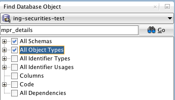

# SQL Developer

## Search for table or columns

* Go to 'Find Database Object' window
* Connect to the required database
* Select appropriate items in the tree below
* Type name of the table or column in the input field
* Press <kbd>ENTER</kbd>

## Shortcuts

* Execute a query in worksheet: <kbd>CTRL</kbd> + <kbd>ENTER</kbd>
